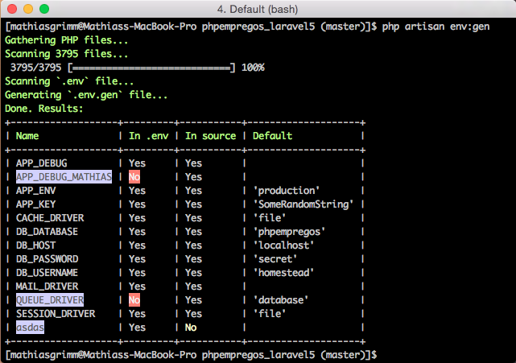

# Laravel Dot Env Generator
A Laravel 5 command that generates a `.env.gen` file containing all environment
variables defined in `.env` as well as any undefined variables that are being
used throughout the project.

# Installation

Install the package using composer:

```bash
composer require mathiasgrimm/laravel-dot-env-gen:dev-master
```

Add the service provider:

```php
// config/app.php

'providers' => [
	...
	'MathiasGrimm\LaravelDotEnvGen\DotEnvGenServiceProvider',
	...
],
```

Add `.env.gen` to your `.gitignore`

## Configuration

You can control which directories are scanned by providing exclusion rules in
the `dotenvgen.php` config file. For a fresh Laravel install, we suggest that
all subdirectories inside `vendor` are ignored except for `vendor/laravel`.

Publish the config file:

```bash
php artisan vendor:publish --provider="Vendor\Providers\DotEnvGenServiceProvider" --tag="config"
```

Example config:

```php
// config/dotenvgen.php

'rules' => [
	// Ignores all files inside `vendor` except for those in `vendor/laravel`
	'vendor' => ['laravel'],

	// Ignores the `database/seeds` directory
	'database/seeds' => [],
],
```

# Usage

From the command line, run `php artisan env:gen`.

A `.env.gen` file will be generated in your project's root folder. Make any
changes you may need, then rename the file to `.env`.

Along with generating the `.env.gen` file, the command will notify you if a
defined environment variable is unused as well as alert you if an undefined
environment variable is being used.

## Screenshot


